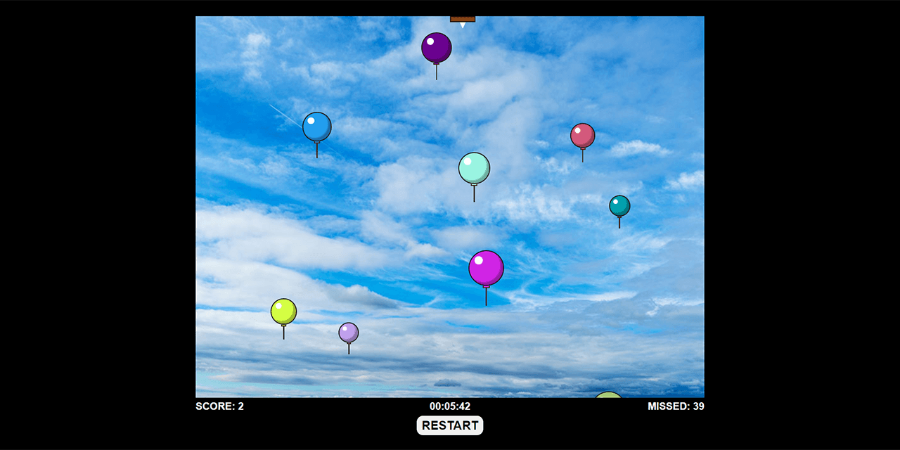

# Balloons Popping game
**Vanilla JavaScript test assignment project**

### About

A simple vanilla JavaScript balloons popping game with a little CSS. Controls: left and right arrows.
* Current live version at https://cat-street.github.io/24h-balloons/

### Assignment conditions
* Balloons are generated with random size/color/speed (currently, speed depends on the size of a balloon)
* There is a needle at the top of the game screen. Player can move it left/right
* If a balloon contacts with a needle, this balloon pops, and the user score increases
* There is a reverse countdown of 1 minute. Balloons stop generating when the time is up
* Balloons quantity should increase and their speed should increase over time (currently, balloons are generated in an interval which reduces every 15 seconds)
* There is a random wind effect from the left or the right side of the game screen
    * The wind is stronger at the side it is blowing from
    * Balloons can't be blown out of the game screen, they should stop at the border
* When all the balloons moved across the upper game screen border, a counters with all popped and all missed balloons must be shown
